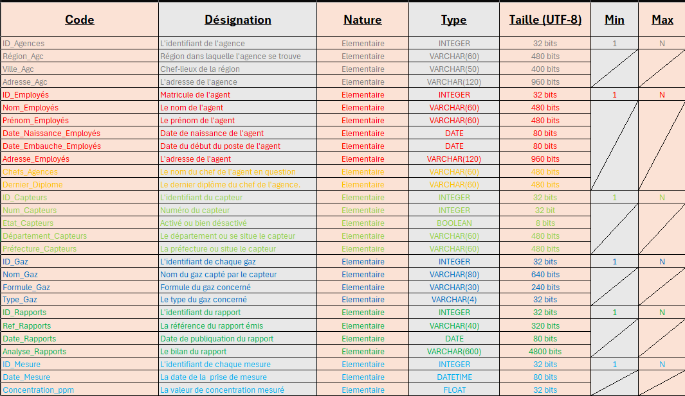
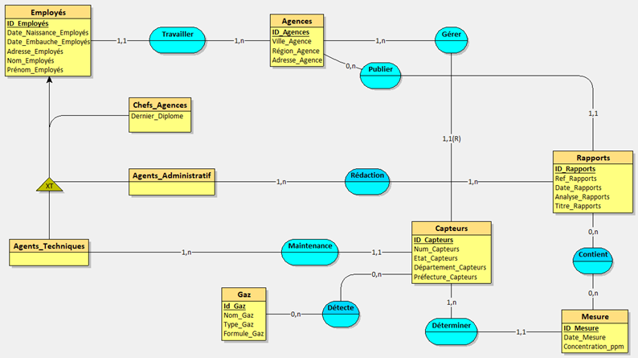
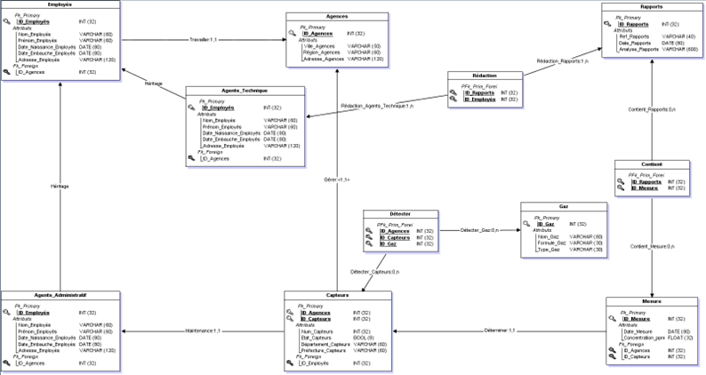
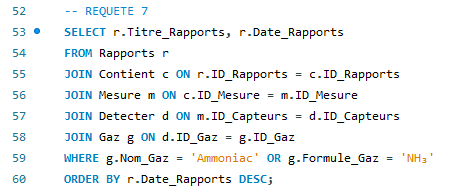

# Projet ClearData – Modélisation et Conception d’une Base de Données Relationnelle

## Contexte du Projet

Ce projet a été réalisé dans le cadre de la formation d’ingénieur à **CESI École d’Ingénieurs**, dans l’unité **Bases de Données et Modélisation**.  
L’objectif était de concevoir une base de données complète et normalisée à partir d’un **cas d’étude inspiré du monde réel**.

---

## Énoncé du Projet

L’entreprise **ClearData**, mandatée par le **Ministère de la Transition Écologique**, a pour mission de **centraliser et analyser des données publiques** sur la **qualité de l’air** en France.  
Elle doit être capable de stocker les informations relatives :
- aux **agences régionales** de surveillance,  
- aux **employés et agents techniques**,  
- aux **capteurs déployés** sur le territoire,  
- aux **gaz mesurés**,  
- et aux **rapports produits** par ces agences.

L’objectif final :  
-> créer une base de données permettant de **suivre les concentrations de gaz à effet de serre** (naturels et industriels) sur l’ensemble du territoire français, et d’en **analyser les tendances via des requêtes SQL**.

---

## Problématiques Principales

1. Comment modéliser une base de données garantissant la **cohérence et la normalisation** des informations collectées ?  
2. Comment relier efficacement les **entités “agences”, “employés”, “capteurs” et “gaz”** tout en respectant les contraintes métier ?  
3. Comment permettre la **génération de rapports** fiables sur les concentrations de gaz par **région**, **période** et **type de gaz** ?  
4. Comment peupler et exploiter cette base de manière **réaliste et automatisée** ?

---

## Démarche de Conception (Méthode Merise)

1. **Analyse du besoin et Dictionnaire de Données**  
   - Définition de tous les attributs nécessaires (code, désignation, type, taille, etc.)  
   - Identification des dépendances fonctionnelles.
  
   

2. **Modèle Conceptuel de Données (MCD)**  
   - Regroupement des attributs en entités et associations.  
   - Définition des cardinalités (ex. : une agence possède plusieurs agents).  

   

3. **Normalisation (1NF → 3NF)**  
   - Respect des trois premières formes normales afin d’éviter les redondances et anomalies d’insertion.

4. **Modèle Logique de Données (MLD)**  
   - Conversion des entités et relations en tables, avec clés primaires (PK) et étrangères (FK).  

   

5. **Modèle Physique de Données (MPD)**  
   - Traduction en langage SQL (types de données, contraintes, clés composées).  

   

6. **Implémentation et Peuplement de la Base**  
   - Génération de 100 employés, 18 agences, 100 capteurs et 19 gaz différents.  
   - Données générées via **Mockaroo** et **ChatGPT** pour garantir la cohérence et la variété.  

---

## Exploitation et Requêtes SQL

### Exemples de requêtes développées :
- 🔍 **Lister toutes les agences** avec suppression des doublons.  
- 👷 **Afficher le personnel technique** d’une agence donnée (ex. : Bordeaux).  
- 📊 **Compter le nombre total de capteurs** déployés.  
- 🗓️ **Lister les rapports publiés entre deux années précises.**  
- 💨 **Afficher les concentrations de CH₄ (méthane)** dans plusieurs régions sur une période donnée.  
- 📉 **Identifier la région avec les plus faibles concentrations de PFC.**  
- 📈 **Calculer la moyenne annuelle des concentrations par gaz.**  
- ⚙️ **Comparer le nombre de capteurs et de personnels** par région.  

  

Requête qui liste les titres et dates des rapports traitant des concentrations d'ammoniac (NH₃), triés du plus récent au plus ancien !

---

## Technologies Utilisées

- **Méthode Merise** (MCD, MLD, MPD)  
- **MySQL / SQL Workbench**  
- **Mockaroo** (génération de données aléatoires)  
- **ChatGPT** (génération semi-automatique de jeux de données)  
- **Excel / Looping** (modélisation graphique)  

---

## 📂 Structure du Dépôt

